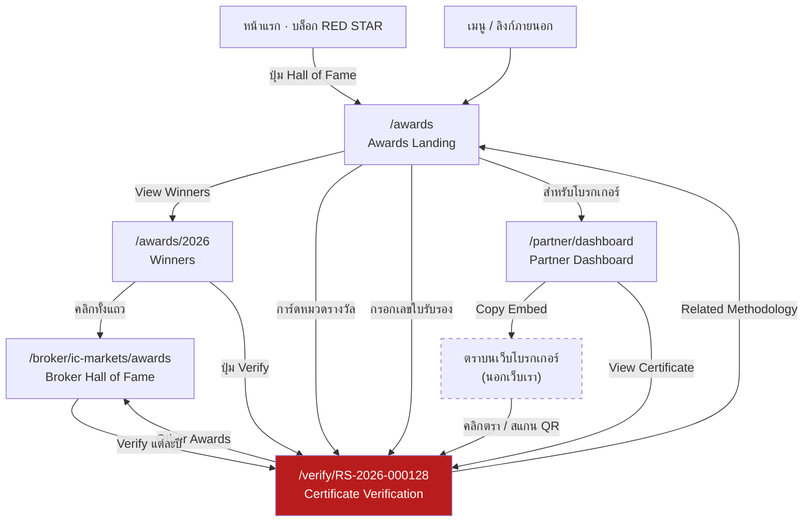

# RedStar Awards — Design Specification

> **สถานะ:** ข้อเสนอ · ข้อมูลในต้นแบบเป็นข้อมูลสมมติทั้งหมด · รอ Boss อนุมัติ
> **ผู้ออกแบบ:** Noting (UX/UI) · **วันที่:** 28 ส.ค. 2569
> **ต้นแบบกดใช้งานได้:** `design/redstartrust-homepage-mockup.html` — หน้า `awards` / `awards2026` / `verify` / `brokerawards` / `partner`

---

## 0. สรุปสำหรับผู้อ่านเร็ว

### เรามีรางวัลเดียว คือ **ดาวแดง**

**ไม่มีรางวัลชื่อภาษาอังกฤษหลายชื่อ** — ทุกอย่างที่เราตรวจรวมมาจบที่ดาวดวงเดียว
ดาวดวงนี้คือดวงเดียวกับโลโก้เว็บ เป็นทั้งสัญลักษณ์ของแบรนด์และตัวรางวัล

| แกน | ค่า |
|---|---|
| **ชื่อรางวัล** | **RED STAR** · รางวัลทรงคุณค่า |
| **ระดับรางวัล** | จำนวนดาว **1 ถึง 3** — ระบบเดียวกับดาวที่ใช้อยู่ทั้งเว็บ |
| **รอบการมอบ** | **รายไตรมาส** ปีละ 4 รอบ · ดาวหมดอายุทุกไตรมาส ต้องได้ใหม่ทุกรอบ |
| **มอบตาม** | หมวดโบรกเกอร์ 6 หมวดของเว็บ (Forex/CFD · ฟิวเจอร์ส · หุ้น · คริปโต · Exchange · กองทุน) |
| **เขียนเต็ม** | *RED STAR · Forex / CFD · Q2 2026 · ★★★* |
| **เลขใบรับรอง** | `RS-<ปี><ไตรมาส>-<เลขลำดับ>` เช่น `RS-2026Q2-000128` |

> **ทำไมดาวหมดอายุทุกไตรมาส:** รางวัลรายปีทำให้โบรกที่คุณภาพตกกลางปียังถือตราเดิมได้อีกหลายเดือน
> รอบไตรมาสทำให้ตราที่แขวนอยู่บนเว็บโบรก **สะท้อนสถานะที่ใกล้ปัจจุบันเสมอ** และทำให้ Hall of Fame
> มีความหมายจริง เพราะการรักษาดาวไว้ได้ติดต่อกันหลายไตรมาสยากกว่าการได้ครั้งเดียว

> **ทำไมถึงเป็นแบบนี้:** ถ้ามีรางวัลหลายชื่อ ("Best Execution", "Best Support") คนอ่านต้องจำว่าชื่อไหนสำคัญกว่าชื่อไหน
> พอรวมเหลือดาวดวงเดียว **คนเห็นดาวแดงที่ไหนก็รู้ทันทีว่าคืออะไร** และเทียบกันได้ด้วยจำนวนดาว
> ดาวยังเป็นสิ่งที่เว็บใช้อยู่แล้วในตารางอันดับ — รางวัลจึงไม่ใช่ระบบใหม่ที่ลอยมา แต่คือ**ยอดของระบบเดิม**

### ระบบตรวจสอบ

แกนที่สองคือ **เลขใบรับรอง (Certificate ID)** หนึ่งเลขต่อหนึ่งรางวัล เลขนี้ปรากฏบน
ตราที่โบรกนำไปติด → บนหน้า Verify → ในตารางผู้ชนะ → ใน Partner Dashboard
ทุกจุดชี้กลับมาที่ `redstartrust.com/verify/<ID>` ซึ่งเป็น **แหล่งความจริงเดียว**

> ถ้าตราถูกก๊อปไปใช้โดยโบรกที่ไม่ได้รางวัล คนกดตราแล้วจะเจอหน้า Verify ที่บอกว่า
> ใบรับรองนี้เป็นของใคร ปีไหน — **การปลอมจึงไม่ได้ผลโดยตัวออกแบบเอง** ไม่ต้องพึ่งการไล่จับ

---

## 1. เรื่องที่ต้องให้ Boss ตัดสินก่อน (สำคัญ — อ่านก่อนอนุมัติ)

| # | เรื่อง | ผมทำอะไรไปก่อน | ทำไมต้องให้ Boss ตัดสิน |
|---|---|---|---|
| A | **สีแดงหลัก** บรีฟระบุ `#B91C1C` แต่ทั้งเว็บล็อกไว้ที่ `#D92D20` | ใช้ `#B91C1C` เฉพาะ 5 หน้า Awards ตามบรีฟ · ส่วนหัวเว็บ/เมนู/หน้าอื่นยังเป็น `#D92D20` | ตอนนี้เว็บมีแดงสองเฉด ถ้าเปลี่ยนทั้งเว็บเป็น `#B91C1C` ต้องแก้ทุกหน้า — **เป็นการตัดสินใจเรื่องแบรนด์ ไม่ใช่ของผม** |
| B | **สีทอง** เดิมกฎคือทองใช้ได้ที่การ์ดอันดับ 1 เท่านั้น บรีฟใหม่ขอ Deep Red + Gold บนตรา | ใช้ทองในระบบ Awards (ตรา · Hall of Fame · ถ้วยรางวัล) | ขัดกับกฎเดิมที่ Boss ล็อกไว้ — ต้องยืนยันว่ากฎใหม่ทับกฎเก่า |
| C | **ใช้ชื่อโบรกจริง** บรีฟระบุ `/broker/ic-markets/awards` | ทำตามบรีฟ ใช้ IC Markets และโบรกจริงอีก 11 ราย | **นี่คือใบรับรองที่ดูเหมือนของจริง** ถ้าหลุดออกไปเป็นภาพ อาจถูกเข้าใจผิดว่าโบรกนั้นได้รางวัลจริง ผมใส่แถบเตือน "ข้อมูลสมมติ" ไว้ทุกหน้าที่เกี่ยวกับใบรับรองแล้ว แต่**ควรพิจารณาเปลี่ยนเป็นชื่อสมมติจนกว่าจะมีการตรวจจริง** |
| D | **QR ยังสแกนไม่ได้** | วาดเป็นภาพแทนที่คงที่ต่อเลขใบรับรอง | ต้องใช้ตัวเข้ารหัส QR จริงตอนพัฒนา |
| E | คะแนน น้ำหนัก 25/25/20/15/15 และรายชื่อผู้ชนะทั้งหมด | ใช้ตัวเลขสมมติที่คำนวณสอดคล้องกันเอง | ต้องมาจาก GCSI จริง |
| F | **สิทธิ์ใช้โลโก้โบรกเกอร์** | ใช้โลโก้จริง 11 ราย ที่เหลือเป็นไทล์ตัวอักษรย่อ | ยังไม่ได้คำตอบจาก Doing (ดู `ASK-DOING-LOGO-RIGHTS.md`) |

---

## 2. User Flow



**อ่านผังนี้ยังไง:** ทุกเส้นทางจบที่ **หน้า Verify (สีแดง)** นั่นคือเจตนาของการออกแบบ —
ไม่ว่าคนจะมาจากเว็บเรา หรือมาจากตราที่ติดอยู่บนเว็บโบรกเกอร์ ปลายทางคือหน้าเดียวกัน
กล่องเส้นประคือส่วนที่อยู่**นอกเว็บเรา** ซึ่งเราควบคุมไม่ได้ จึงต้องออกแบบให้มันชี้กลับมาหาเราเสมอ

### เส้นทางหลัก 3 เส้น

| ผู้ใช้ | เข้ามาทำอะไร | เส้นทาง | สิ่งที่ต้องเห็นภายใน 5 วินาที |
|---|---|---|---|
| **เทรดเดอร์** | หาโบรกที่น่าเชื่อถือ | Home → Awards → Winners → Broker Hall of Fame | ใครได้กี่ดาวในหมวดไหน |
| **คนขี้สงสัย** | เห็นตราบนเว็บโบรก อยากรู้ว่าจริงไหม | ตรา → Verify | ป้าย **VERIFIED** เขียว + ชื่อโบรก + ปี |
| **โบรกเกอร์** | เอารางวัลไปติดเว็บตัวเอง | Partner Dashboard → Copy Embed | ปุ่มดาวน์โหลดและโค้ดฝัง |

---

## 3. Design System

### 3.1 Color Tokens

โทเคนทั้งหมดประกาศบน `.page[data-page="awards|awards2026|verify|brokerawards|partner"]`

| Token | Hex | ใช้ที่ไหน |
|---|---|---|
| `--aw-red` | `#B91C1C` | ปุ่มหลัก · เส้นบนใบรับรอง · หลอดคะแนน · เส้นขีดใต้การ์ดตอน hover |
| `--aw-red-d` | `#7F1313` | สถานะ hover ของปุ่มหลัก |
| `--aw-red-l` | `#FDF2F2` | พื้นไอคอน · พื้นป้าย Winner · เมนูที่เลือกอยู่ |
| `--aw-red-e` | `#F6D5D5` | ขอบป้าย Winner · เส้นคั่นในกล่องเหตุผล |
| `--aw-ink` | `#0A0A0A` | หัวข้อ · พื้นหลังส่วนดำ (Hero, CTA, ตรา) |
| `--aw-ink-2` | `#3F3F46` | เนื้อความ |
| `--aw-ink-3` | `#71717A` | คำอธิบายรอง · หัวคอลัมน์ตาราง |
| `--aw-line` | `#E4E4E7` | เส้นขอบการ์ดและตาราง |
| `--aw-line-2` | `#F4F4F5` | เส้นคั่นภายใน · รางหลอดคะแนน |
| `--aw-gold` | `#A98420` | **พื้นและเส้นเท่านั้น** — ขอบตรา · เลขปีบนถ้วย · หลอดคะแนนที่ ≥96 |
| `--aw-gold-t` | `#7A5C11` | **ทองสำหรับตัวอักษร** — อันดับ Hall of Fame · ป้าย Hall of Fame |
| `--aw-gold-l` | `#FBF6E7` | พื้นป้าย Hall of Fame · ไล่สีบนถ้วยรางวัล |
| `--aw-gold-e` | `#EBDCA8` | ขอบป้าย Hall of Fame · ขอบการ์ดถ้วย |
| `--aw-ok` | `#05603A` | ป้าย VERIFIED · ตราประทับ |
| `--aw-ok-l` | `#ECFDF3` | พื้นป้าย VERIFIED |

> **กฎทองที่ต้องจำ:** `--aw-gold` **ห้ามใช้เป็นสีตัวอักษรบนพื้นขาว** (คอนทราสต์ 3.5 ตกเกณฑ์)
> ตัวอักษรทองต้องใช้ `--aw-gold-t` เสมอ — ตรวจแล้วได้ 6.2 บนขาว และ 5.8 บนพื้นทองอ่อน

### 3.2 Spacing — 8pt Grid

| Token | ค่า | ใช้ที่ไหน |
|---|---|---|
| `--s1` | 8px | ช่องไฟระหว่างป้าย · gap ในปุ่ม |
| `--s2` | 16px | padding แถวตาราง · gap ระหว่างการ์ดเล็ก |
| `--s3` | 24px | padding การ์ด · gap กริดการ์ด |
| `--s4` | 32px | ระยะห่างระหว่างช่วงย่อยในการ์ด |
| `--s5` | 40px | ใต้หัวข้อ section |
| `--s6` | 48px | padding กล่องใหญ่ (Hero ใบรับรอง, CTA) |
| `--s7` | 64px | gap สองคอลัมน์หน้า Hall of Fame |
| `--s8` | 80px | ท้ายหน้า |
| `--s9` | 96px | **ระยะบนของทุก section** — จังหวะหลักของหน้า |

**Container:** 1200px · **Artboard:** 1440px · ขอบซ้ายขวา 120px

### 3.3 Typography

| Style | ขนาด / น้ำหนัก | Letter-spacing | Line-height | ใช้ที่ไหน |
|---|---|---|---|---|
| Hero H1 | 62 / 700 | −0.04em | 1.04 | หัวหน้า Awards Landing |
| **H1** `.aw-h1` | 46 / 700 | −0.035em | 1.1 | หัวหน้าใหญ่ |
| **H2** `.aw-h2` | 30 / 700 | −0.03em | 1.2 | หัวข้อ section |
| Award Title | 38 / 700 | −0.035em | 1.15 | ชื่อรางวัลบนใบรับรอง |
| **H3** `.aw-h3` | 19 / 700 | −0.02em | 1.3 | หัวการ์ด |
| **Body** `.aw-body` | 14.5 / 400 | 0 | 1.75 | เนื้อความ |
| **Caption** `.aw-cap` | 11.5 / 700 | +0.06em UPPERCASE | 1.6 | ป้ายกำกับ section |
| Numeric | IBM Plex Sans · tabular-nums | | | คะแนน · เลขใบรับรอง · สถิติ |

ฟอนต์: **Inter** (ละติน) + **IBM Plex Sans Thai** (ไทย) + **IBM Plex Sans** (ตัวเลข)

### 3.4 Buttons

| Variant | Class | พื้น | ขอบ | ตัวอักษร |
|---|---|---|---|---|
| Primary | `.aw-btn.pri` | `--aw-red` | `--aw-red` | ขาว |
| Outline | `.aw-btn.out` | โปร่ง | `--aw-line` | `--aw-ink` |
| Ghost | `.aw-btn.ghost` | โปร่ง | ไม่มี | `--aw-red` |
| On-black | `.aw-btn.onblk` | โปร่ง | ขาว 28% | ขาว |

ขนาดปกติ `padding 12/22 · radius 8 · font 14/600` · ขนาดเล็ก `.sm` = `8/15 · radius 7 · font 12.5`
Focus ทุกปุ่ม: `outline 2px solid --aw-red · offset 3px`

### 3.5 Badges (ป้ายสถานะบนเว็บ)

| Class | ความหมาย | สี |
|---|---|---|
| `.aw-tag.vf` | Verified — ใบรับรองใช้ได้ | เขียว `--aw-ok` บน `--aw-ok-l` |
| `.aw-tag.win` | Winner ปีนั้น | แดง `--aw-red` บน `--aw-red-l` |
| `.aw-tag.hof` | Hall of Fame (ได้หลายปี) | ทอง `--aw-gold-t` บน `--aw-gold-l` |
| `.aw-tag.rev` | ปีที่ไม่ผ่านเกณฑ์ / ถูกเพิกถอน | ส้ม `#93500B` บน `#FEF6EE` |

### 3.6 Cards

| Component | Class | โครงสร้าง |
|---|---|---|
| **Award Card** | `.aw-card` | ไอคอน 40 → หัว → คำอธิบาย → แถบท้าย (โลโก้ผู้ชนะ + ลิงก์) |
| **Certificate Card** | `.vf-hero` | สองคอลัมน์ `1fr / 260px` — ซ้ายข้อมูล ขวา QR + ตราประทับ · **ขอบบนแดง 4px** |
| **Broker Card** | `.w26-bk` | ไทล์โลโก้ 34 + ชื่อ + หน่วยงานกำกับ |
| **Analytics Card** | `.pt-k` / `.pt-ch` | ป้าย → ตัวเลข 30px → เปรียบเทียบ / กราฟ |
| **Trophy Card** | `.ba-tro` | หัวดำ (ชื่อรางวัล) → ตัวไล่สีทอง (ปี + คำอธิบาย) → ท้ายการ์ด (เลขใบรับรอง) |

### 3.7 Progress Bar · Table · Timeline · QR

- **Progress Bar** `.vf-tr` — สูง 8 · radius 4 · รางสี `--aw-line-2` · ตัวเติมแดง · **≥96 เปลี่ยนเป็นทอง**
- **Table** `.w26` — หัวตารางพื้น `#FAFAFA` · แถวสูง 14px padding · hover พื้น `#FAFAFA` · ทั้งแถวกดได้ (`tabindex="0"`)
- **Timeline** `.aw-tl` — เส้นแนวตั้ง 2px · จุด 16px ขอบ 3px · แดง = ปีล่าสุด · ทอง = ปีก่อน ๆ · เทา = ปีที่ไม่ได้รางวัล
- **QR** `.vf-qr` — 150×150 ในกรอบขาว radius 10 · finder pattern แกนแดง `--aw-red`

---

## 4. Award Badge System

ตราคือ **สินทรัพย์ชิ้นเดียวที่ออกไปอยู่นอกเว็บเรา** จึงต้องออกแบบให้ดูเป็นเอกสารรับรอง ไม่ใช่สติกเกอร์

### 4.1 ขนาดและการใช้งาน

| ขนาด | อัตราส่วน | ตั้งใจให้ใช้ที่ไหน |
|---|---|---|
| **320 × 100** | 3.2 : 1 | ขนาดมาตรฐาน — หน้า About / หน้ารางวัลของโบรก |
| **240 × 75** | 3.2 : 1 | แถบท้ายเว็บ |
| **180 × 56** | 3.2 : 1 | ขนาดเล็กสุด — sidebar, แถบ trust bar |
| **512 × 512** | 1 : 1 | โซเชียล · รูปโปรไฟล์ · อีเมล |

### 4.2 องค์ประกอบ (ทุกขนาดต้องมีครบ)

1. พื้นดำ `#0A0A0A` + **ขอบทอง 1.5px** — ขอบคือสิ่งที่ทำให้ดูเป็นเอกสารรับรอง
2. **ดาวแดงดวงใหญ่** — ดวงเดียวกับโลโก้เว็บ ใช้ path เดียวกัน (`AW_D` + `AW_FACET`) ไม่ใช่ดาววาดใหม่
3. **`RED STAR`** — คำว่า RED เป็นสีแดง `#E8483E` · STAR สีขาว · ใหญ่ที่สุดในตรา
4. **`รางวัลทรงคุณค่า`** — ทอง `#A98420` letter-spacing กว้าง
5. **หมวด · ไตรมาส** — ขาว 70% เช่น *Forex / CFD · Q2 2026*
6. **ดาวเล็ก 3 ดวง** — ดวงแดงคือดาวที่ได้ ดวงเทาคือที่ยังไม่ได้ (ขนาด 512 ใช้ดาวเต็มดวง 3 ดวง)
7. บรรทัดล่าง: `VERIFIED · เลขใบรับรอง`
8. เฉพาะ 512: เส้นคั่นทอง + `redstartrust.com/verify`

> **ดาวในตราต้องเป็นดาวดวงเดียวกับโลโก้เป๊ะ ๆ** — ถ้าวาดใหม่ให้ "ดูคล้าย" ตราจะไม่เชื่อมกับแบรนด์
> โค้ดจึงดึง path ของโลโก้มาย่อส่วนใน `<g transform="scale()">` แทนที่จะเขียนดาวใหม่

### 4.3 กฎการใช้ตรา (แสดงบนหน้า Downloads)

- ห้ามตัดส่วน เปลี่ยนสี หรือเพิ่มข้อความในตรา
- **ต้องลิงก์กลับมาหน้าตรวจสอบเสมอ** — นี่คือเงื่อนไขการใช้ ไม่ใช่คำแนะนำ
- **ใช้ได้เฉพาะไตรมาสที่ระบุบนตรา** — ไตรมาสถัดไปต้องเปลี่ยนตราใหม่
- ถ้ารางวัลถูกเพิกถอน ตราจะหมดอายุทันทีและหน้าตรวจจะขึ้นว่าเพิกถอน

> **เหตุผลเชิง UX:** เสิร์ฟตราจาก CDN ของเราเอง (`cdn.redstartrust.com/badge/<ID>/<size>.svg`)
> ทำให้เราปิดตราของโบรกที่ถูกเพิกถอนได้ทันทีโดยไม่ต้องขอให้เขาลบเอง
> **ตราที่แจกเป็นไฟล์ให้โหลดไปวางเองจะปิดไม่ได้** — จึงต้องมีทั้งสองแบบ และแนะนำแบบ embed เป็นค่าเริ่มต้น

---

## 5. รายละเอียดรายหน้า

### PAGE 1 — `/awards`

| Section | โครงสร้าง | หมายเหตุ |
|---|---|---|
| Hero | เต็มความกว้าง พื้นดำ · padding 96/80 · ดาวจาง 5% ชิดขวา | H1 62px · `RED` เป็นสีแดง |
| Hero stats | 4 คอลัมน์ คั่นด้วยเส้นขาว 12% | จบด้วย **"0 รางวัลที่มาจากการจ่ายเงิน"** — ประโยคนี้คือจุดยืน |
| Award Categories | กริด 3 คอลัมน์ gap 24 | hover: ยกขึ้น 2px + เส้นแดงบนการ์ดวิ่งจากซ้าย |
| Hall of Fame | ตาราง 5 คอลัมน์ `56 / 1fr / 150 / 190 / 120` | เรียงตามจำนวนปีที่ได้ |
| Methodology | 5 คอลัมน์ ขอบบนแดง 2px | น้ำหนัก 25/25/20/15/15 |
| CTA | พื้นดำ radius 14 · `1fr / 380px` | กล่องขาวมีช่องกรอกเลขใบรับรอง |

### PAGE 2 — `/awards/2026`

- ฟิลเตอร์ 4 ตัว: **ไตรมาส · Region · Category · License** + ตัวนับผลลัพธ์ชิดขวา
- เปลี่ยนไตรมาสแล้วรายชื่อและเลขใบรับรองเปลี่ยนตาม (รอบเก่ามีรายชื่อน้อยกว่า เพราะตอนนั้นเราตรวจได้น้อยราย)
- คอลัมน์: `อันดับ · โบรกเกอร์ · หมวด · ดาวที่ได้ · คะแนน · เลขใบรับรอง · Verify`
- อันดับ 1 เป็นสีทอง `--aw-gold-t`
- **ทั้งแถวกดได้** → ไปหน้า Broker Hall of Fame · ปุ่ม Verify แยก event ไม่ชนกัน
- สถานะว่าง: บอกตรง ๆ ว่า *"เราไม่ประกาศรางวัลของขอบเขตที่ยังไม่ได้เข้าไปตรวจ"*

### PAGE 3 — `/verify/RS-2026-000128` ← **หน้าสำคัญที่สุด**

หัวใบรับรองเรียงเป็น **ดาวโลโก้ 64px → `RED STAR` → `รางวัลทรงคุณค่า` → หมวด+ปี → แถวดาว 5 ดวง 26px**
คนเห็นแล้วรู้ทันทีว่าได้รางวัลอะไร ระดับไหน โดยไม่ต้องอ่านตัวอักษร

ลำดับข้อมูลออกแบบตามคำถามที่คนกดเข้ามาถามในหัว เรียงตามลำดับจริง:

1. **"ของจริงไหม"** → Hero Card: ป้าย VERIFIED เขียว + ตราประทับ + QR + เลขใบรับรอง + สถานะ *"ไม่ถูกเพิกถอน"*
2. **"ได้เพราะอะไร"** → Evaluation Score 5 ตัว เป็นหลอด พร้อมค่าจริงกำกับ (เช่น *34 ms*) ไม่ใช่แค่ตัวเลขลอย ๆ
3. **"ตัดสินจากอะไร"** → Why We Selected 3 ข้อ **แต่ละข้อบอกที่มาของข้อมูล**
4. **"เคยได้ไตรมาสไหนบ้าง"** → Timeline 3 ไตรมาสล่าสุด (หน้าโปรไฟล์แสดง 6 ไตรมาส)
5. **"เกณฑ์คืออะไร"** → Related Methodology + แถบเตือนข้อมูลสมมติ

> **Micro-interaction:** หลอดคะแนนวิ่งจาก 0 → ค่าจริงเมื่อเข้าหน้า (1.1s, `cubic-bezier(.2,.7,.3,1)`)
> ทำให้สายตาไล่อ่านทีละหลอด แทนที่จะเห็นทุกอย่างพร้อมกันแล้วไม่รู้จะดูตรงไหน

### PAGE 4 — `/broker/<slug>/awards`

- Hero `1fr / 300px` — ซ้ายโลโก้ + สถิติ 3 ตัว (รางวัลทั้งหมด · ปีแรก · คะแนนสูงสุด) · ขวา **Trophy Card**
- Trophy Card: ดาวโลโก้ 58px บนหัวดำ → `RED STAR` → หมวด → **แถวดาว 5 ดวง 22px** บนพื้นไล่สีทอง
- Timeline แนวตั้ง **6 ไตรมาสล่าสุด** แต่ละไตรมาสมีแถวดาวของรอบนั้น ให้เห็นว่าขยับขึ้นหรือลง
- **รวมไตรมาสที่ไม่ได้ดาวด้วย** (Q2 2025 → ป้ายส้ม *"ไม่ได้รับรางวัล"* พร้อมเหตุผลว่าคำสั่งถอนเกินเกณฑ์ 2 ครั้ง)

> ไทม์ไลน์รายไตรมาสอ่านได้เป็น**เส้นกราฟคุณภาพ** — Q1 2025 ได้ 2 ดาว → Q2 หลุด → Q3 กลับมา 2 → Q4 ขึ้น 3 → คงที่ 3 ดาวจนถึงปัจจุบัน
> ข้อมูลระดับนี้เป็นสิ่งที่รางวัลรายปีให้ไม่ได้

> **นี่คือจุดตัดสินใจที่สำคัญที่สุดของหน้านี้** — ถ้าโชว์แต่ปีที่ชนะ หน้านี้จะกลายเป็นแผ่นโฆษณา
> การแสดงปีที่ไม่ผ่านด้วยคือสิ่งที่ทำให้ปีที่ผ่านมีน้ำหนัก ตรงกับหลักใน `CORE-PILLAR.md`

### PAGE 5 — `/partner/dashboard`

- เมนูซ้าย 232px sticky · เนื้อหาขวายืดหยุ่น
- **Overview** — KPI 4 ใบ (Awards Won · Badge Views · Clicks · CTR) + กราฟ 30 วัน + Countries + Top Referrers
- **My Awards / Certificates** — การ์ดละรางวัล: ตราตัวจริง + 4 ปุ่ม + โค้ดฝังพร้อมก๊อป
- **Downloads** — ตรา 4 ขนาด + กฎการใช้ตรา
- **Analytics** — กราฟแท่ง 30 วัน (7 วันล่าสุดเป็นสีแดงเพื่อให้เห็นช่วงล่าสุดทันที) + Clicks + สัดส่วนประเทศ/referrer
- ทุกแท็บปิดท้ายด้วยแถบเตือน *"ข้อมูลสมมติ"*

---

## 6. Micro-interaction

| จังหวะ | สิ่งที่เกิดขึ้น | ระยะเวลา / easing | เหตุผล |
|---|---|---|---|
| **Hover Award Card** | ยกขึ้น 2px · เงาลึกขึ้น · เส้นแดงบนการ์ดวิ่งจากซ้ายไปขวา | 220ms ease / เส้น 280ms `cubic-bezier(.2,.7,.3,1)` | บอกว่ากดได้ โดยไม่ต้องมีปุ่ม |
| **Verify Success** | หลอดคะแนน 5 ตัววิ่งจาก 0 พร้อมกัน | 1100ms `cubic-bezier(.2,.7,.3,1)` | ทำให้หน้ารู้สึกว่า "กำลังตรวจแล้วได้ผล" ไม่ใช่หน้านิ่ง |
| **Copy Embed** | ปุ่มเปลี่ยนเป็น "คัดลอกแล้ว" 1.8s + toast ดำลอยขึ้นจากล่าง | toast 220ms ease | ยืนยันสองชั้น — ที่ปุ่ม (ตรงที่สายตาอยู่) และที่ toast |
| **Download** | toast แจ้งผล | 220ms ease · ค้าง 2.4s | |

**หลักที่ยึด:** ไม่มีอนิเมชันไหนเกิน 1.1 วินาที · ไม่มีอะไรเด้ง (bounce) · ไม่มีอะไรวนซ้ำไม่จบ
ทั้งหมดเป็น *ease-out* — เร็วตอนเริ่ม ช้าตอนจบ ซึ่งอ่านว่า "เสร็จแล้ว" ไม่ใช่ "กำลังเล่น"

---

## 7. Responsive Notes

ต้นแบบทำที่ **Desktop 1440** เป็นหลักตามบรีฟ ด้านล่างคือข้อกำหนดสำหรับตอนพัฒนาจริง

| Breakpoint | สิ่งที่ต้องเปลี่ยน |
|---|---|
| **≥1440** (Desktop — ที่ออกแบบไว้) | container 1200 · ทุกกริดเต็มจำนวนคอลัมน์ |
| **1024–1439** | container ยืดเต็ม padding 48 · Award Categories 3→2 คอลัมน์ · Methodology 5→3 · Partner sidebar 232→200 |
| **768–1023** (Tablet) | Hero H1 62→44 · Certificate Hero สองคอลัมน์ → เรียงบนล่าง (QR ขึ้นบน) · Award Categories → 2 · ตารางผู้ชนะเลื่อนแนวนอนใน `overflow-x:auto` · Partner sidebar → แถบแท็บแนวนอนด้านบน |
| **<768** (Mobile) | Hero H1 → 34 · ทุกกริด → 1 คอลัมน์ · Hero stats 4→2×2 · **ตารางผู้ชนะเปลี่ยนเป็นการ์ดต่อแถว** (อันดับ+โลโก้บรรทัดบน / รางวัล+คะแนนบรรทัดล่าง / ปุ่ม Verify เต็มความกว้าง) · Timeline เส้นเลื่อนไปซ้าย padding 20 · ตราแสดงเฉพาะขนาด 180×56 กับ 512 |

**สิ่งที่ห้ามยุบไม่ว่าจอเล็กแค่ไหน**
- ป้าย VERIFIED และเลขใบรับรอง — เป็นเหตุผลเดียวที่คนเปิดหน้านี้
- QR — ต้องไม่ต่ำกว่า 120px ไม่งั้นสแกนไม่ติด
- ค่าจริงกำกับหลอดคะแนน (เช่น *34 ms*) — ถ้าตัดออก คะแนนจะกลายเป็นตัวเลขลอย ๆ ที่พิสูจน์ไม่ได้

> **ข้อควรระวังที่เจอมาแล้วในโปรเจ็คนี้:** อย่าใช้ `@media (max-width: …)` ในต้นแบบ
> เพราะ media query อ่านความกว้างจอจริง ไม่ใช่ความกว้างของเฟรม 1440 ที่เราจำลอง — จะทำให้เลย์เอาต์พังตอนดูในกรอบ

---

## 8. Figma-Ready Layout Specification

### 8.1 การตั้งไฟล์

| หัวข้อ | ค่า |
|---|---|
| Frame | Desktop 1440 × ความสูงอิสระ |
| Grid | 12 คอลัมน์ · gutter 24 · margin 120 · **Layout grid 8pt** |
| Page structure | `01 Cover` / `02 Foundations` / `03 Components` / `04 Screens` / `05 Badges` / `06 Flows` |

### 8.2 Auto Layout ต่อ Component

| Component | Direction | Padding | Gap | Resizing |
|---|---|---|---|---|
| `Button/Primary` | Horizontal | 12 / 22 | 8 | Hug × Hug |
| `Badge/Verified` | Horizontal | 4 / 11 | 6 | Hug × Hug |
| `Card/Award` | Vertical | 24 | 16 | Fill × Hug |
| `Card/Certificate` | Horizontal | 48 | 48 | Fill × Hug |
| `Row/Winner` | Horizontal | 16 | 16 | Fill × Fixed 60 |
| `ProgressBar` | Vertical | 0 | 8 | Fill × Hug |
| `Timeline/Item` | Vertical | 0 0 32 30 | 6 | Fill × Hug |
| `Sidebar/Item` | Horizontal | 10 / 14 | 0 | Fill × Hug |
| `Card/Analytics` | Vertical | 24 | 24 | Fill × Hug |

### 8.3 Variants ที่ต้องทำ

| Component | Properties |
|---|---|
| `Button` | `type` = primary / outline / ghost / on-black · `size` = md / sm · `state` = default / hover / focus |
| `Badge` | `type` = verified / winner / hall-of-fame / revoked |
| `Card/Award` | `state` = default / hover |
| `Timeline/Item` | `status` = current / past / none |
| `Badge/Award` (ตรา) | `size` = 320×100 / 240×75 / 180×56 / 512×512 · `stars` = 1–5 |
| `StarRow` | `stars` = 0–5 · `size` = 13 / 14 / 15 / 22 / 26 |

### 8.4 Naming Convention

```
color/aw/red/base        #B91C1C
color/aw/gold/text       #7A5C11
space/s3                 24
text/h2                  30/700/-0.03em
```

### 8.5 ส่งต่อให้ Dev

- ตราต้องเป็น **SVG** ไม่ใช่ PNG — ต้องคมทุกความละเอียดและแก้เลขใบรับรองจากเซิร์ฟเวอร์ได้
- ทุกไอคอนเป็น stroke 1.8–2.0 บน 24×24 viewBox · `stroke-linecap="round"`
- ทุก interactive element ต้องมี focus ring ที่มองเห็นได้ — ห้าม `outline: none` เปล่า ๆ

---

## 9. Accessibility

ตรวจแล้วผ่านทั้ง 5 หน้า

- **คอนทราสต์** ผ่าน WCAG 2.1 AA ทุกจุด (ปกติ ≥4.5 · ตัวใหญ่ ≥3.0) — วัดจาก DOM จริงในเบราว์เซอร์
- **แถวตารางกดได้** มี `tabindex="0"` และ focus ring
- **QR** มี `role="img"` + `aria-label`
- **ตรารางวัล** มี `aria-label` เต็ม เช่น *"RedStar Best ECN Broker 2026 ตรวจสอบแล้ว"*
- **เมนู Partner** ใช้ `aria-current` ไม่ใช่แค่สี
- **Toast** ใช้ `role="status"` — โปรแกรมอ่านหน้าจอจะอ่านให้เมื่อคัดลอกโค้ดสำเร็จ
- ไม่มีข้อมูลไหนสื่อด้วยสีอย่างเดียว — VERIFIED มีทั้งสีเขียว เครื่องหมายถูก และคำว่า Verified

---

## 10. ทางเข้าจากหน้าแรก

เพิ่มปุ่ม **Hall of Fame** (ขอบทอง มีไอคอนถ้วย) ไว้ใต้คำว่า *"รางวัลทรงคุณค่า"* ในบล็อก RED STAR
กดแล้วไปหน้า `/awards`

> วางไว้ตรงนี้เพราะเป็นจุดเดียวบนหน้าแรกที่พูดเรื่องรางวัลอยู่แล้ว
> ใช้ขอบทองแทนปุ่มแดง เพื่อไม่ให้แย่งความสนใจจากดาวใหญ่ที่อยู่ข้าง ๆ

---

## 11. สิ่งที่ยังไม่ได้ทำ (บอกตรง ๆ)

- **ยังไม่ได้ทำ responsive จริง** — หัวข้อ 7 เป็นข้อกำหนดสำหรับตอนพัฒนา ต้นแบบตรึงที่ 1440 ตามบรีฟ
- **QR ยังสแกนไม่ได้** — เป็นภาพแทน
- **ปุ่มดาวน์โหลดยังไม่โหลดไฟล์จริง** — ขึ้น toast แจ้งแทน
- **ยังไม่มีหน้า error ของ Verify** — กรณีเลขไม่ถูกต้อง / ใบรับรองถูกเพิกถอน / หมดอายุ ควรออกแบบเพิ่ม **ผมแนะนำให้ทำ เพราะเป็นหน้าที่พิสูจน์ว่าระบบตรวจสอบทำงานจริง** แต่ยังไม่ได้รับคำสั่งจึงยังไม่ทำ
- **ยังไม่มีขั้นตอนที่โบรกยื่นขอเข้าร่วม** — ตอนนี้ Partner Dashboard สมมติว่าล็อกอินได้แล้ว

---

## 12. บันทึกการเปลี่ยนแนวคิด (28 ส.ค. 2569)

ฉบับแรกผมออกแบบเป็น **รางวัล 6 ชื่อภาษาอังกฤษแยกกัน** (Best ECN Broker · Best Execution · Best Trading Conditions ฯลฯ)
ตามที่บรีฟระบุมา

**Boss แก้ทิศทางว่า** รางวัลของ RedStar คือ **Red Star** ซึ่งรวมทุกอย่างไว้ที่ดาวแดงดวงเดียว
Hall of Fame คือผู้ที่ได้รับ **รางวัลทรงคุณค่า** ของเรา

ผมจึงรื้อใหม่ทั้งระบบ:

| เดิม | ใหม่ |
|---|---|
| รางวัล 6 ชื่อ ภาษาอังกฤษ | **รางวัลเดียว: RED STAR** · ระดับบอกด้วยดาว 1–5 |
| หมวด = ชื่อรางวัลที่คิดขึ้นใหม่ | หมวด = **หมวดโบรกเกอร์ 6 หมวดที่เว็บใช้อยู่แล้ว** |
| ตรามีคำว่า `REDSTAR AWARDS` + ชื่อรางวัล | ตรามี **ดาวโลโก้ + RED STAR + รางวัลทรงคุณค่า + หมวด/ปี + จุดบอกดาว** |
| Hall of Fame เป็นตารางแถบเล็กท้ายหน้า | **Hall of Fame เป็นพระเอก** — การ์ด 5 ใบ หัวดำ มีแถวดาวและจำนวนปี |
| ตารางผู้ชนะ: Rank / Broker / Award / Score | อันดับ / โบรกเกอร์ / **หมวด** / **ดาวที่ได้** / คะแนน / เลขใบรับรอง |

**ผลข้างเคียงที่ดีขึ้นกว่าเดิม:** รางวัลไม่ใช่ระบบใหม่ที่ลอยมาแยกจากเว็บอีกต่อไป
มันคือ**ยอดของระบบดาวที่เว็บใช้อยู่แล้ว** คนที่เห็นดาวในตารางอันดับกับดาวบนใบรับรอง เข้าใจว่าเป็นเรื่องเดียวกัน

---

## 13. แก้ครั้งที่สอง — ดาว 3 ดวง รายไตรมาส (28 ส.ค. 2569)

**Boss แก้ว่า** ดาวมีแค่ **3 ดาว** และได้รับ **ตามไตรมาส**

ผมผิดเองสองจุด:
1. ไปสร้างดาว 4–5 ขึ้นในหน้า Awards **ทั้งที่ทั้งเว็บใช้ 1–3 มาตลอด** (ตรวจ DOM ยืนยันแล้วว่าตารางอันดับมีแต่ 1/2/3)
2. สมมติเอาเองว่ารางวัลเป็นรายปี

| จุด | เดิม (ผิด) | ใหม่ |
|---|---|---|
| ระดับดาว | 1–5 | **1–3** (`AW_STMAX = 3`) |
| รอบมอบ | รายปี | **รายไตรมาส** ปีละ 4 รอบ |
| รอบล่าสุด | 2026 | **Q2 2026** · รอบถัดไป Q3 ประกาศ 15 ต.ค. |
| เลขใบรับรอง | `RS-2026-000128` | **`RS-2026Q2-000128`** — ฝังไตรมาสไว้ในเลข |
| ฟิลเตอร์หน้าผู้ชนะ | Region / Category / License | เพิ่ม **ไตรมาส** เป็นตัวแรก |
| Hall of Fame นับ | จำนวนปี | **จำนวนไตรมาสที่ได้ 3 ดาว** + จำนวนไตรมาสติดต่อกัน |
| ไทม์ไลน์ | 5 ปี | **6 ไตรมาสล่าสุด** |
| สถิติหน้าแรก | "0 รางวัลที่มาจากการจ่ายเงิน" | **"4 รอบตรวจต่อปี · ดาวหมดอายุทุกไตรมาส"** |

**สิ่งที่ดีขึ้น:** ตราที่แขวนบนเว็บโบรกจะสะท้อนสถานะที่ใกล้ปัจจุบันเสมอ ไม่ใช่ภาพเมื่อ 11 เดือนก่อน
และ Hall of Fame วัดจาก **ความสม่ำเสมอ** (ติดกันกี่ไตรมาส) ซึ่งยากกว่าและมีความหมายกว่าการได้ครั้งเดียว

---

## 14. เกณฑ์การให้ดาว — PAGE 6 `/awards/criteria` (28 ส.ค. 2569)

> **ส่วนที่อนุมัติแล้วจริง:** `ผ่านครบ 3,000/3,000 ข้อ = ได้ดาว` + ตรวจใหม่ทุกไตรมาส (GCSI 15 ส.ค. 2569)
> **ส่วนที่เป็นข้อเสนอของ Noting:** นิยามของดาวดวงที่ 2 และ 3 ทั้งหมด — ตัวเลขและเงื่อนไขยังไม่มีผล

### 14.1 ปัญหาที่ต้องแก้

GCSI ตัดสินแบบ **ผ่าน/ไม่ผ่าน** — ผ่านครบ 3,000 ข้อได้ดาว ไม่ผ่านข้อเดียวไม่ได้ดาว
ระบบนี้ไม่มีที่ว่างให้ "ดาวดวงที่ 2 และ 3" เพราะ **ผ่านครบแล้วก็คือครบ ไม่มีอะไรให้ผ่านมากกว่านั้น**

จะเติมดาวได้สองทาง:

| ทางเลือก | ผลที่ตามมา |
|---|---|
| ❌ แบ่ง 3,000 ข้อเป็นชั้น ๆ (เช่น 3 ดาว = ผ่านข้อ w3 ครบ) | **ขัดกฎที่ Boss เคาะไปแล้ว** ว่าทุกข้อมีน้ำหนักเท่ากัน และเท่ากับรื้อระบบ |
| ❌ ใช้เปอร์เซ็นต์ (2 ดาว = ผ่าน 95%) | **ขัดกฎโดยตรง** — กฎบอกว่าไม่ผ่าน 1 ข้อ = ไม่ได้ดาว |
| ✅ **วัดมิติใหม่ที่ชุดตรวจวัดไม่ได้ คือ เวลา และ ความประพฤติ** | ไม่แตะกฎเดิมเลย · กฎเดิมกลายเป็น "ประตูเข้า" ของดาวดวงแรก |

**ผมเลือกทางที่สาม**

### 14.2 เกณฑ์ที่เสนอ

| ดาว | ชื่อระดับ | เงื่อนไข (สะสมขึ้นไป) | ผู้ใช้อ่านว่า |
|---|---|---|---|
| ★ | **ผ่านมาตรฐาน** | ผ่านครบ 3,000/3,000 ในไตรมาสนี้ · ไม่มีข้อค้างตรวจ · หลักฐานเก็บในรอบนี้ | ไม่มีข้อบกพร่องที่เราตรวจเจอในรอบนี้ |
| ★★ | **ผ่านต่อเนื่อง** | ได้ 1 ดาวครบ + **ผ่านติดต่อกัน 3 ไตรมาส** + ไม่มีเรื่องเลยกำหนดตอบใน Broker Alerts | รักษามาตรฐานได้ต่อเนื่องเกือบหนึ่งปี |
| ★★★ | **ทรงคุณค่า** | ได้ 2 ดาวครบ + **ผ่านติดต่อกัน 6 ไตรมาส** + ผ่านเงื่อนไขความประพฤติ C1–C4 + ไม่เคยถูกถอนดาวในช่วงนั้น | ผ่านทุกรอบมาหนึ่งปีครึ่ง และปฏิบัติต่อลูกค้าดีตลอดทาง |

### 14.3 เงื่อนไขความประพฤติ (เฉพาะดาวที่ 3)

| รหัส | เงื่อนไข |
|---|---|
| **C1** | ตอบทุกเรื่องใน Broker Alerts ภายในกำหนด ไม่มีเรื่องใดเลยกำหนด |
| **C2** | ไม่มีข้อพิพาทที่ปิดด้วยข้อสรุปว่าโบรกเกอร์ผิด ตลอด 6 ไตรมาสที่นับ |
| **C3** | คำชี้แจงที่ส่งมาไม่ขัดกับหลักฐานที่ทีมตรวจถืออยู่ — ถ้าขัด ถือว่าไม่ผ่านทันทีและสตรีคขาด |
| **C4** | ไม่ปรากฏใน warning list ของหน่วยงานกำกับระดับหลัก ตลอดช่วงที่นับ |

C1–C2 ผูกตรงกับหน้า **Broker Alerts** และ **Broker Dashboard** ที่ออกแบบไว้แล้ว — ระบบเดียวกัน ไม่ใช่ของใหม่

### 14.4 การถอนดาว

| กรณี | ผลกับดาว |
|---|---|
| ไม่ผ่านแม้ข้อเดียวในรอบใหม่ | **ดาวหายทั้งหมดทันที** สตรีคกลับเป็นศูนย์ — ไม่ลดทีละดวง |
| ผ่านครบแต่สตรีคขาดไปก่อนหน้า | ได้ **1 ดาว** แล้วไต่ขึ้นใหม่ |
| ผิดเงื่อนไขความประพฤติข้อใดข้อหนึ่ง | ลดจาก 3 เหลือ **2 ดาว** ทันที |
| ตรวจไม่ครบในรอบใหม่ | แสดง **อยู่ระหว่างตรวจ** และคงดาวไตรมาสก่อนไว้ (ตาม GCSI §3.2) |

> **ทำไมถอนหมดทีเดียว ไม่ลดทีละดวง:** ถ้าลดทีละดวง โบรกที่ไม่ผ่านข้อสำคัญยังถือ 2 ดาวอยู่
> ซึ่งขัดกับกฎ *ไม่ผ่าน 1 ข้อ = ไม่ได้ดาว* โดยตรง — การถอนหมดจึงเป็นทางเดียวที่ไม่ทำลายกฎเดิม

### 14.5 การออกแบบหน้า

| ส่วน | สิ่งที่ทำ |
|---|---|
| **หัวหน้า** | ดาวโลโก้ 56px + คำอธิบายว่าทำไมดาวดวงที่ 2–3 ไม่ได้มาจากการผ่านมากขึ้น |
| **การ์ด 3 ใบ** | ดาวแถว → ชื่อระดับไทย/อังกฤษ → คำนำ → เช็คลิสต์ติ๊ก → แถบท้าย "ผู้ใช้อ่านว่า" · ใบ 3 ดาวพื้นดำ ขอบทอง |
| **กราฟเส้นทาง 8 ไตรมาส** | แท่ง + ดาวรายไตรมาส · ไตรมาสที่หลุดเป็นแท่งลายทแยง |
| **ตารางความประพฤติ** | C1–C4 |
| **10 เสา** | P01–P10 เสาละ 300 ข้อ ให้เห็นที่มาของ 3,000 |
| **ตารางถอนดาว** | 4 กรณี |
| **กล่องส้มท้ายหน้า** | แยกชัดว่าอะไรอนุมัติแล้ว อะไรเป็นข้อเสนอ |

**จุดที่ตั้งใจที่สุดคือกราฟเส้นทาง** — มันแสดงว่าพลาดหนึ่งข้อที่ Q4 2024 แล้วต้องใช้เวลา
**หนึ่งปีครึ่ง**กว่าจะกลับมาที่ 3 ดาว ราคาของการพลาดจึงแพงมากโดยตั้งใจ
ตัวเลขเดียวกันนี้ทำให้ตราที่แขวนอยู่บนเว็บโบรกมีน้ำหนักจริง

### 14.6 ผลกระทบกับหน้าที่ทำไว้แล้ว

ปรับตัวเลขให้สอดคล้องกับเกณฑ์ใหม่แล้วทุกหน้า:
- **ไทม์ไลน์ใบรับรอง** ไต่ตามกฎจริง — Q1 2025 (สตรีค 4, 2 ดาว) → Q3 2025 (สตรีค 6, **ขึ้น 3 ดาว**) → Q2 2026 (สตรีค 9)
- **Hall of Fame** หัวการ์ดเปลี่ยนเป็น **จำนวนไตรมาสที่ผ่านติดต่อกัน** เพราะนั่นคือตัวเลขที่กำหนดระดับดาวจริง
- **ป้ายบนใบรับรอง** เปลี่ยนจาก "Hall of Fame · 9 ไตรมาส" เป็น **"ผ่านติดกัน 9 ไตรมาส"**
